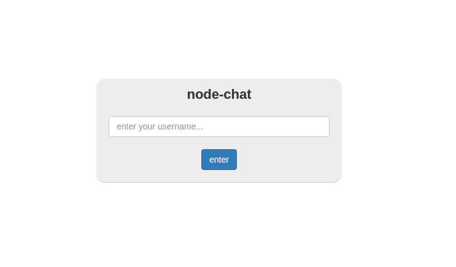
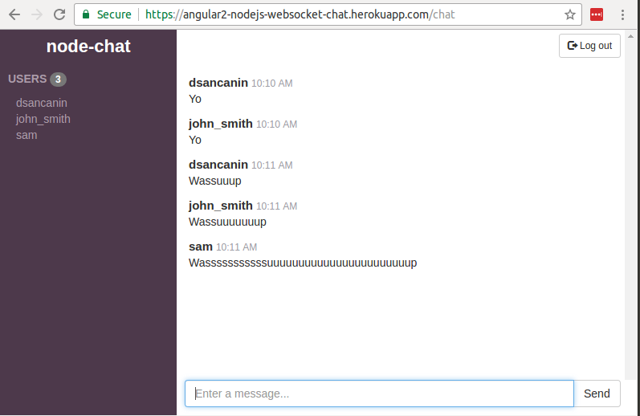

# angular2-nodejs-websocket-chat
Test chat application with an angular2 frontend and nodejs backend using socket.io for handling web socket communication.

Demo available at [https://angular2-nodejs-websocket-chat.herokuapp.com](https://angular2-nodejs-websocket-chat.herokuapp.com).

### Running the app
`npm run dev` starts the angular app and node server in watch mode to allow direct editing of files. (i.e. `concurrently "ng serve --progress false --proxy-config proxy.conf.json" "nodemon server/server.js"`). This starts the angular app on port 4200 and the node server on port 3000. Access the site via angular on port 4200 and the web socket connections are proxied to port 3000 via the proxy config passed in.

`npm run prod` starts the node server in production mode which serves up the angular app. (i.e. `ng build --prod && NODE_ENV=production node server/server.js`). The server listens on port 3000 if no PORT env setting is set.

### Deploying to Heroku
- install heroku
- `heroku login`
- `heroku create angular2-nodejs-websocket-chat`
- `git remote add heroku https://git.heroku.com/angular2-nodejs-websocket-chat.git`
- `git subtree push --prefix angular2-nodejs-websocket-chat heroku master` (pushing subtree because the app folder is not the root of the repo)
- `heroku ps:scale web=1`
- `heroku open`