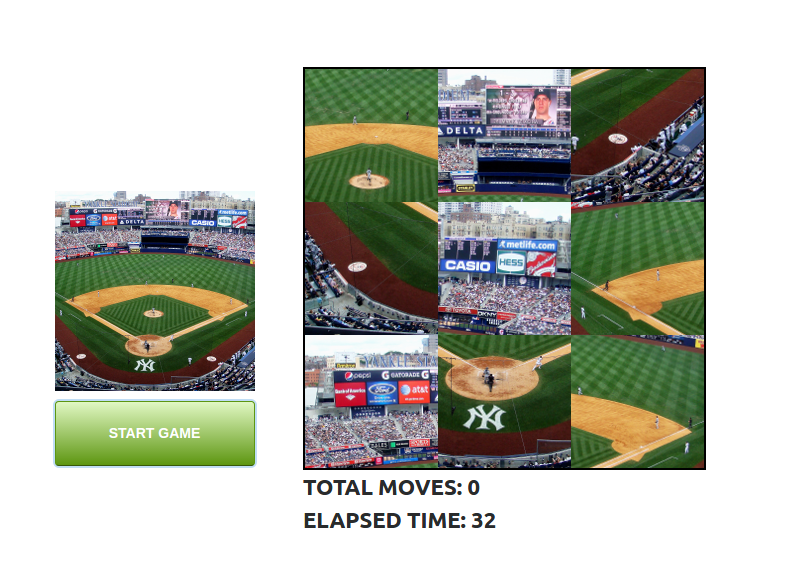
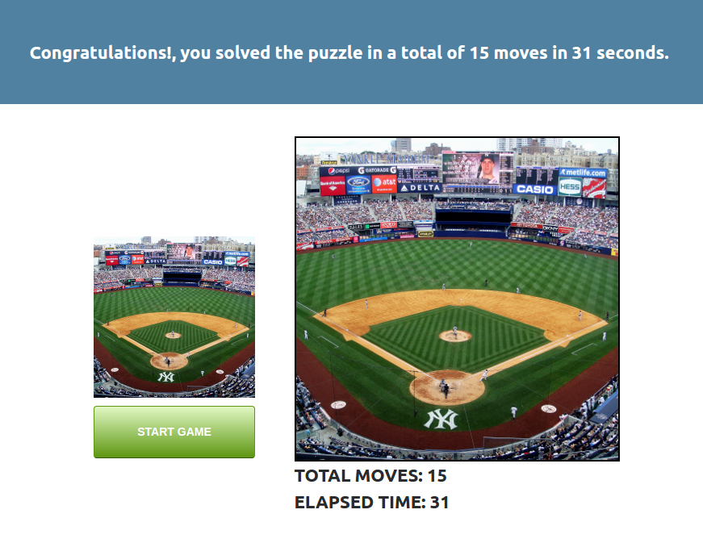

# angular2-puzzle
Simple 9 piece puzzle done as a coding challenge using Angular2. 

Demo available at [http://angular2-puzzle.s3-website-us-west-2.amazonaws.com](http://angular2-puzzle.s3-website-us-west-2.amazonaws.com).

### Running the app
`ng serve` starts the angular app in watch mode. You can access it on port 4200.

`ng build` builds the app to the /dist folder.

`ng build --prod` builds the app in production mode to the /dist folder.

